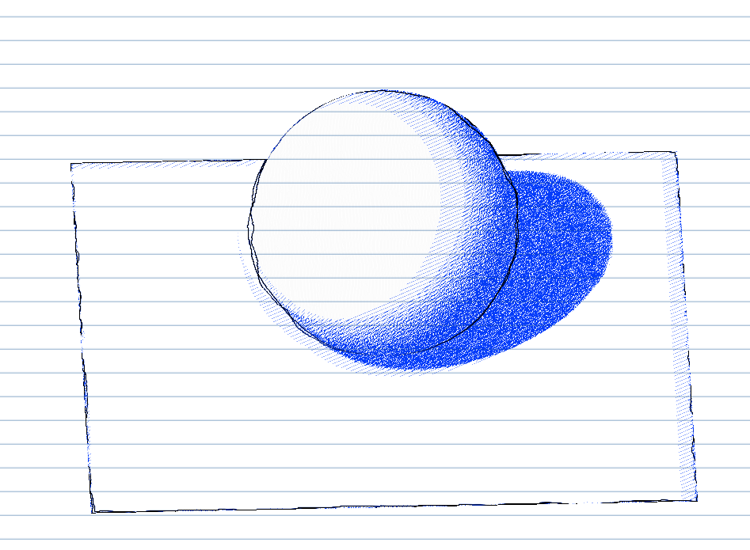
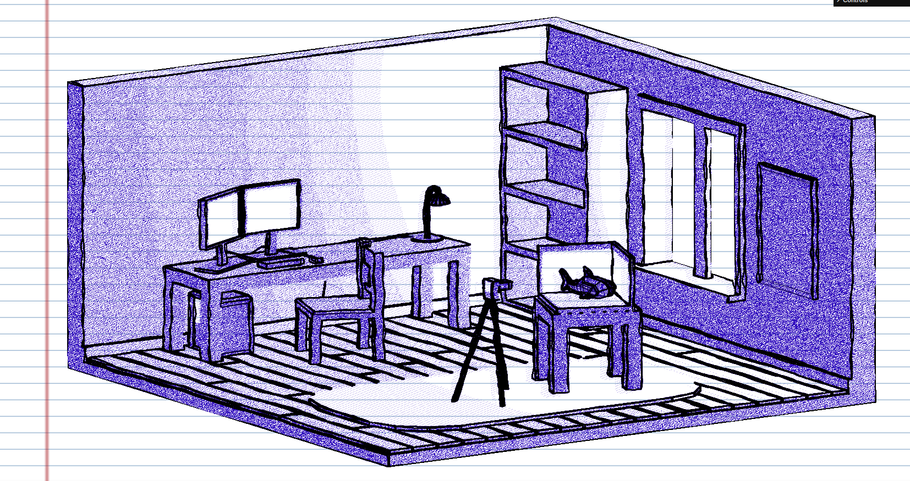
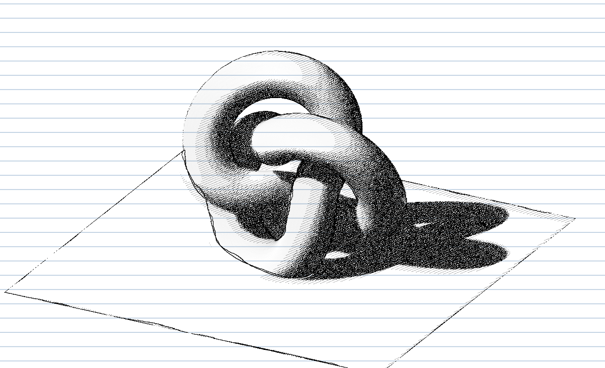

# Ballpoint Shader

A Three.js post-processing shader that renders scenes as if they were drawn with a ballpoint pen on notebook paper.

**Try it out here:** https://hillydaan.github.io/

<p align="center">
  
  
  
</p>

## Installation

```bash
npm install
npm run dev
```


## Use in own project
Create the post processor:

```ts
const post = new Post(renderer);
```

In your render loop:

```ts
post.render(scene, camera);
```

Optionally load a paper texture:

```ts
post.setPaperTexture(texture);
```

---

## How it works

The effect is built from three layers: hatching, edges, and paper.

### Hatching

The scene is first rendered to a colour buffer.

Luminance values are quantised into hatch levels. Darker areas receive more hatch layers while lighter areas receive fewer. Each layer is rotated and slightly warped using noise to avoid perfectly straight digital-looking lines.

Multiple warped UV samples are accumulated to create the uneven look of pen strokes.

### Edges

A second render pass stores surface normals.

A Sobel filter is applied to the normal buffer to detect silhouette and feature edges. These edges are composited on top of the hatching pass to improve readability and help define forms.

### Paper

The final image is drawn onto a paper layer.

The paper layer can contain:

* Paper grain texture
* Notebook lines
* Margin line
* Ink/paper colour blending

This helps break up large flat areas and gives the final result a more physical appearance.

---

## Parameters

### Hatching

| Parameter         | Description                                |
| ----------------- | ------------------------------------------ |
| `inkColor`        | Colour of the pen ink                      |
| `hatchBackground` | Enables hatching in empty background areas |
| `scale`           | Overall hatch density                      |
| `thickness`       | Hatch line thickness                       |
| `angle`           | Base hatch angle                           |
| `noisiness`       | Random stroke wobble                       |
| `intensity`       | UV warp strength                           |

### Edges

| Parameter       | Description     |
| --------------- | --------------- |
| `edgeColor`     | Edge colour     |
| `edgeThickness` | Edge width      |
| `edgeStrength`  | Edge visibility |

### Paper

| Parameter        | Description                   |
| ---------------- | ----------------------------- |
| `paperEnabled`   | Enables paper rendering       |
| `paperScale`     | Paper grain scale             |
| `lineSpacing`    | Notebook line spacing         |
| `lineColor`      | Notebook line colour          |
| `lineOpacity`    | Notebook line opacity         |
| `marginColor`    | Margin line colour            |
| `marginPosition` | Margin position               |
| `marginOpacity`  | Margin opacity                |
| `paperOpacity`   | Ink and paper blending amount |

### Debug Modes

| Mode | Description   |
| ---- | ------------- |
| `0`  | Final output  |
| `1`  | Colour buffer |
| `2`  | Normal buffer |
| `3`  | Hatching only |
| `4`  | Edges only    |

---

## Optimisations

### Baked lighting

The shader only works with the final rendered colour buffer. If performance is important, lighting can be baked into textures before rendering.

This removes expensive real-time lighting calculations while preserving most of the visual result.

### Hatch levels

The hatching pass currently uses 10 levels:

```glsl
const int levels = 10;
```

Reducing this value decreases the amount of work done per pixel and can provide a noticeable performance improvement on lower-end devices.

The trade-off is less tonal variation in shaded areas.
